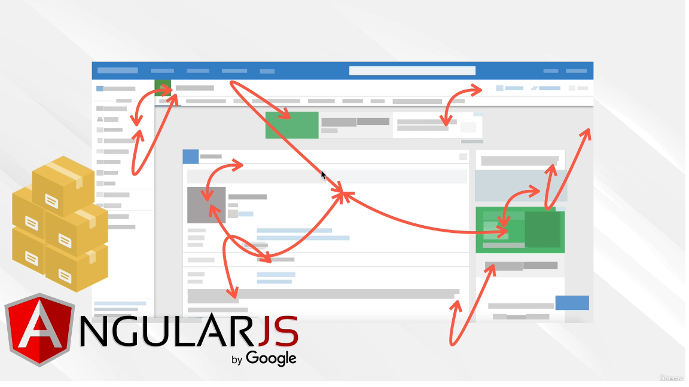

# Section 2: React Key Concepts

## 5. React Concepts

Lead projects instead of only following tutorials

Before React
Why React?
UI Layer
Declarative
Component Architecture
Unidirectional Data Flow

I do recommend that this section is something you come back to after you've watched through the entire

course.

     
     
     
    
---------------------------------------------------------------------------------------------------------------------------

     
     
     

## 6. The Birth of React.js

What did we have before React?

Basic HTML, CSS, and JavaScript (interactivity)

it started with simple forms, where we send from the backend when we go to a url, all these files.

Let say a user submits a form, we store that data.

As we wanted to use more JavaScript we had to account for more browsers sometimes they worked differnlty from each other. Then we had jQuery to easily work with the DOM across the diffeernt browsers.

jquery had a unified API
But with this power develpers started building bigger and bigger applications

instead of something small, we started getting these massive massive applciations like Facebook with features like messages, friends, news feeds.

As websites turned into new applications and besides just requesting more and more pages like a blog. Well libraries like backbone.js came up.

Because JS files got larger and larger. Backbone allowed us to organize these JavaScript files.

There was the birth of the SPA.

At first we'd fetch some files each time we clicked a link.

But with more advancement like we had with Jquery Backbone and something called Ajax, we now had a different system.

We load the application code once.

Where we returned a new document. Our application act more like a desktop application. The JS updates the HTML file or the DOM to display new things. like signin without speaking to the server anymore.

in 2010 Angular.js became the standard way to create the applications.

You had code now that has better containers. Where you have things like controls, views and models. MVC MVVM pattern.

We have more complexity, people noticed its getting hard to find bugs in the code, and understand how each part of the app was affecting the other.

Facebook was also having similar issues, so they came up with a solution called React.

Angular.js rewritten to Angular no js.
Many people moved to React
Became the most popular frontend tool

That is, it became the most popular and tool with the most job demand across the world and being used

by very large companies like Airbnb, Uber, Netflix, Twitter, Reddit, Pinterest, Wick's PayPal

stripe, Tumblr, Walmart.

What made React so great?

Lets find out in the next section.

     
     
     
    
---------------------------------------------------------------------------------------------------------------------------

     
     
     

## 7. Declarative vs Imperative

## 8. Component Architecture

## 9. One Way Data Flow

1. Don't touch the DOM. I'll do it.

2. Build website like lego blocks

3. Unidirectional data flow

Unidirectional Data flow

## 10. UI Library

## 11. How To Be A Great React Developer

## 12. React Latest Version!

## 13. Web Developer Monthly
