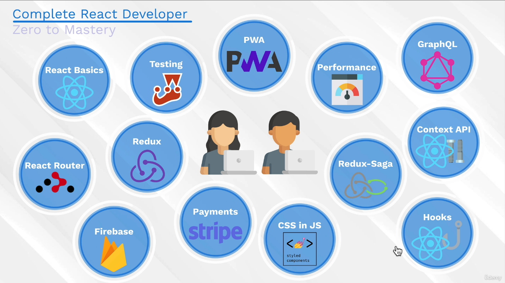

# Section 1: Introduction

## 1. Course Outline
Build a large Ecommerce App

Introduce topics such as React Router, Firebase to have different pages on our app and to do user sign ins

Redux: So our app is ready to scale 
Stripe: Payments API, to make online purchases

And don't worry, we're going to teach you these topics from scratch.

And this is where most courses would stop.

CSS in JS, Styled Components a popular library

Redux-Saga: a scalable way for us to handle asynchronous actions in our app

(React) Hooks: Seeing how it compares with Redux
(React) Context API: Again comparing to how it works with Redux and Hooks

GraphQL: To manage at an even larger scale our state. 

We implement Firebase features in different ways, even creating a strip backend, so our app can process payments.

Design patterns: Such as observables or higher order components 
We even touch on the important topic of performance

PWA: We implement our app as a Progressive Web App
Testing: Using Jest

     
     
     
    
-------------------------------------------------------------------------------------------------------------------------------------------------------------

     
     
     

## 2. Join Our Online Classroom!

instagram: andreineagoie
twitter: andreineagoie

I joined the Discord, I still haven't found an accountability buddy. 

     
     
     
    
-------------------------------------------------------------------------------------------------------------------------------------------------------------

     
     
     

## 3. Exercise: Meet Your Classmates and Instructor

     
     
     
    
-------------------------------------------------------------------------------------------------------------------------------------------------------------

     
     
     

## 4. Monthly Coding Challenges, Free Resources and Guides